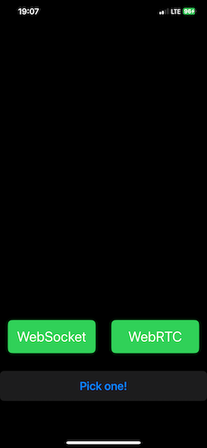

# iOS WebSocket & WebRTC with OpenAI Realtime API

The app uses my [fork](https://github.com/jeffxtang/swift-realtime-openai) of the Swift SDK for OpenAI's Realtime API package [here](https://github.com/m1guelpf/swift-realtime-openai) to support both WebRTC and WebSocket.

If you need to add the package in your own app (or readd to this app), open the project in Xcode, select your project > Package Dependencies, click the +, enter https://github.com/jeffxtang/swift-realtime-openai.git, and click Add Packages.

Credit also to the OpenAIOSRealtimeAPIDemo repo [here](https://github.com/fuwei007/OpenAIIOSRealtimeAPIDemo/tree/main/SwftDemo/RealTim-WebRTC).

To run the app, simply open the project in Xcode, replace OPENAI_API_KEY in ContentView.swift with your key, set your iOS signing team, and build and run on your iPhone. The audio chat with OpenAI Realtime API can't run on iOS simulator.

